# RECT_ACT v0.1.0
_**Categories:** meta-plugin, distortion_

## Installation
_**Disclaimer:** this plugin will most likely only work on 64-bit x86-64 Windows computers!_
Download the `.dll` file in the `bin/` directory and place it into your DAW's VST folder.
Previous versions of the plugin are also available, in case you need them.

## Compiling The Source Code
_**Note:** you don't need to compile the source code if you just want to use the plugin, just download the `.dll`._ \
Make sure you have Cargo installed on your computer (the Rust compiler). Then in the root of the repository run `cargo build`. Once Cargo is done building, there should be a `RECT_ACT_v0_1_0.dll` file in the newly created `debug/` directory. Place this file into your DAW's VST folder.

# What is RECT_ACT?
RECT_ACT stands for "rectifier activation [function]", what the hell is that?

The short answer is: a bunch of cool distortion algorithms that I stole from some research papers on neural networks. They kinda sound like tube distortion.

The medium answer is: a collection of asymmetric (even-harmonic) distortion algorithms, with a variable wave-shaper controlled by the "rectify" parameter. The most basic mode, leaky ReLU, is a standard rectifier, and the "rectify" parameter crossfades from dry, to half-wave rectified, to full-wave rectified. All other modes are a bit more sophisticated, but essentially achieve a similar sound. Additionally, the drive parameter boosts the signal before the distortion and balances it after the distortion, to increase harmonics without (significantly) changing the loudness. A soft-clipper is present on the output, which can add symmetric (odd-harmonic) distortion when pushing the drive. A bias control lets you take advantage of the soft-clipper to introduce some more asymmetric distortion, and also affects the sound of the rectifier. There is also dry/wet of course.

To use RECT_ACT as a plain boring saturator, use leaky ReLU mode, with "rectify" all the way down, and turn up drive. This is almost identical to the default curve in Ableton's saturator.

Now, what the fuck is an activation function? It's a type of function used in neural networks, there are a lot of research papers on activation functions, which are also conveniently really good for distortion sounds, so I can just steal the knowledge from the field of neural networks, and bring it over to sound design, neat! *Disclaimer: this plugin does not use neural networks in any capacity, although that would be pretty cool, wouldn't it? Maybe another time...*

Want an explanation of the nitty-gritty technical details? See the "Extra Info for Nerds" section below.

## Controls Explained
+ Drive: (somewhat) loudness compensated pre-gain, increases distortion on some rectifier modes, introduces soft-clipping after rectification.
+ Bias: adds a constant DC signal before rectification, introduces additional asymmetric distortion when driving the soft-clipper.
+ Mode: choose between six activation functions / rectifiers, each interacts with the "rectify" parameter in a unique way:
  + leaky ReLU: standard rectifier function, "rectify" crossfades between no rectification, half-wave rectifier and full-wave rectifier.
  + max tanh: similar to the leaky ReLU, except that the negative half of the wave is also passed through a hyperbolic tangent function (Ableton's saturator default setting).
  + soft plus: very gentle soft-clipping of only the negative half of the wave. "rectify" controls amount of clipping. This mode does not do full-wave rectification.
  + swish: somewhat like soft-plus, except that the negative half has an additional "bump" that sounds like a very mild form of wave-folding. "rectify" controls the amount of clipping and the width of the bump, higher clipping reduces the width of the bump. This mode does not do full-wave rectification.
  + mish: like a cross between leaky ReLU and swish: does full wave rectification, but there is an additional "bump" around 0, that smooths out the transition from the negative to the positive half of the wave. Contrary to swish, this mode does do full-wave rectification.
  + soft tanh: somewhat similar to swish, but the bump is much more pronounced, and moves from the negative to the positive side of the wave as the "rectify" parameter is increased. Sweeping the "rectify" parameter reveals that the timbre changes drastically depending on the amount of rectification, a lot of interesting sweet-spots to explore. Does not do full-wave rectification, although the bump is folding the wave in such a way that it kinda sounds like it's doing full-wave rectification.
+ Rectify: controls amount of rectification, for all modes except leaky ReLU, this is not simply a dry/wet control, but it affects the shape and timbre of the rectifier in interesting ways, it's especially pronounced in the soft tanh mode.
+ dry/wet: mix between un-processed and processed sound.

## Extra Info for Nerds

Here is a more in-depth explanation of the functions used:

### Soft-clipper

The soft-clipper is always on, no matter the mode of the rectifier, and is placed after the rectifier. With a low drive it is barely audible. The function used here is the humble hyperbolic tangent function, or "tanh":

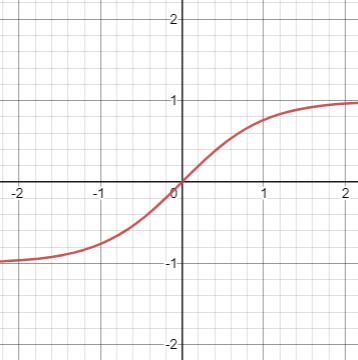

This used to be the standard activation function used in neural networks, until better functions were discovered. It also happens to be the most used saturation function in audio processing, convenient.

### Leaky ReLU

My use of the term ReLU is a bit cheeky here, this is just a normal rectifier, but it also happens to be used in neural networks, so I took the smart-sounding term to sound cool. ReLU stands for "rectifier linear unit".

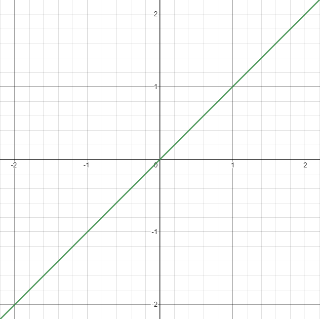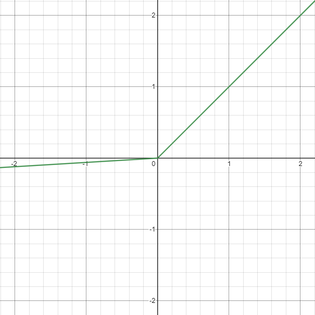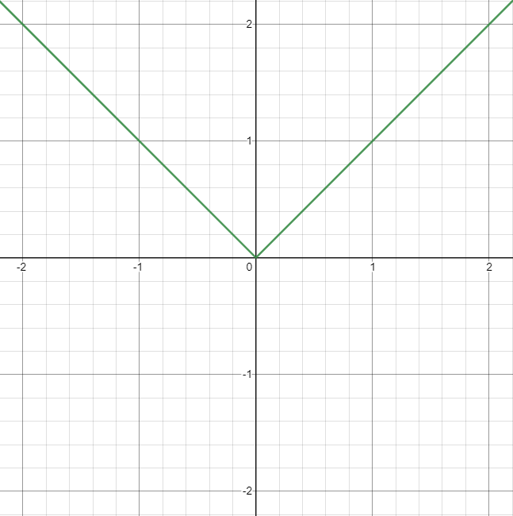

Performs extraordinarily well in neural networks because it's so simple to compute, the function is simply: 

`max(a * x, x)` 

where the `a` parameter is the leakage (the magnitude of the negative half of the wave)

### Max Tanh

Max tanh is a cross between the humble hyperbolic tangent from before and the ReLU:

`max(tanh(a * x), x)`

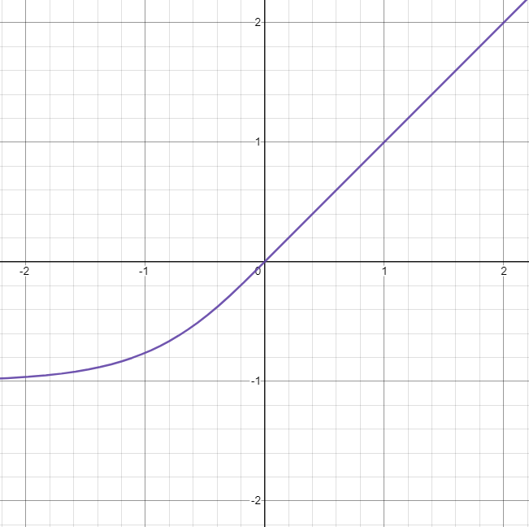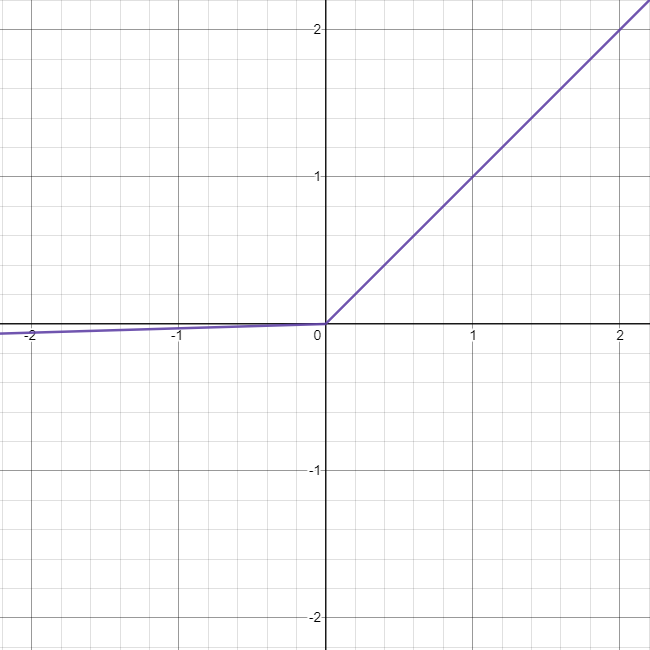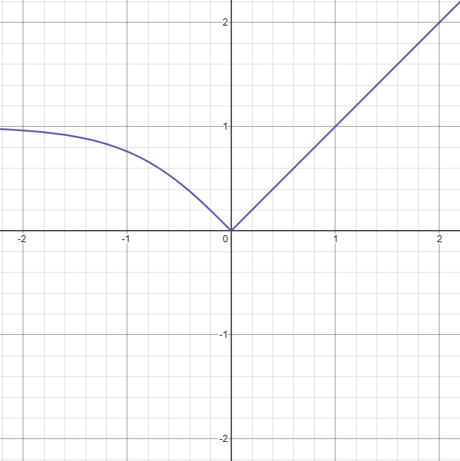

Although in neural network shenanigans `a` is usually just 1

### Soft Plus

I don't really know anything about this one, I found it in a paper and thought it looked cool. I took some liberties to make it cross the origin, normally it hovers above the x-axis a bit. The function is:

`ln(1 + exp(x))`

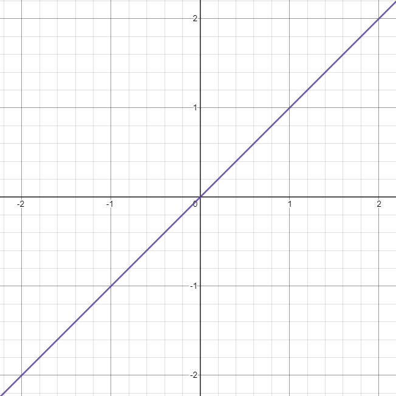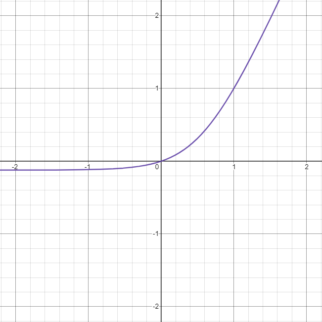

### Swish

This one looks really neat, and kinda sounds like tube distortion. The function is:

`x / (1 + exp(-b * x))`

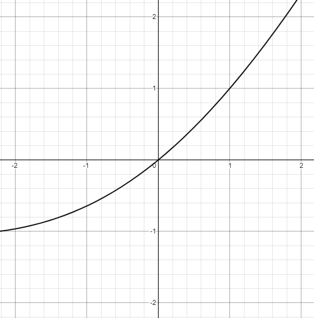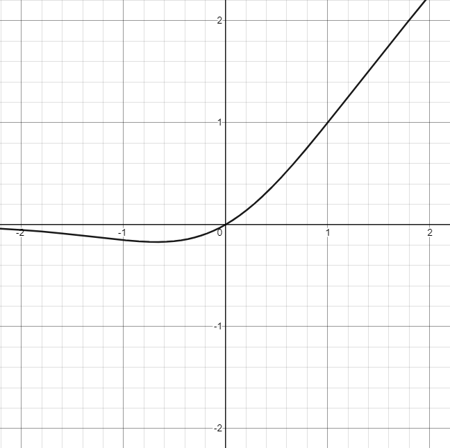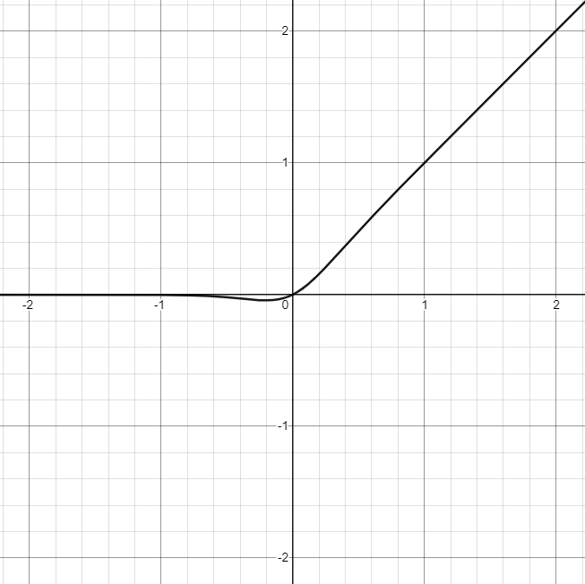

Notice how there's a bump, that sounds like very gentle wave-folding.

### Mish

Beside the fact that it has a funny name, I know nothing about this one.

`x * tanh(ln(1 + exp(x)))`

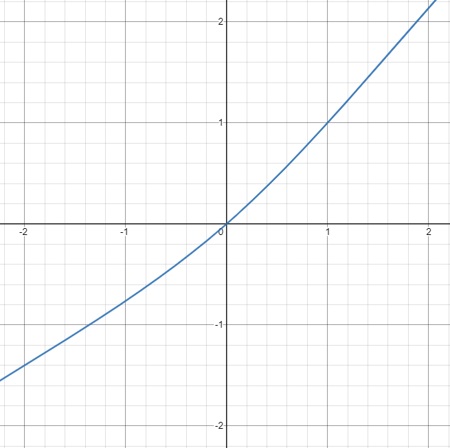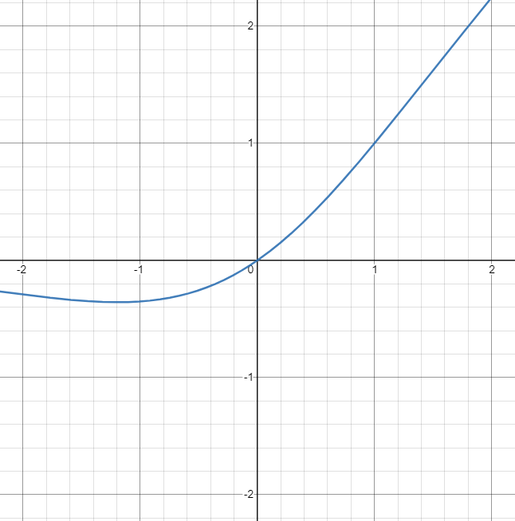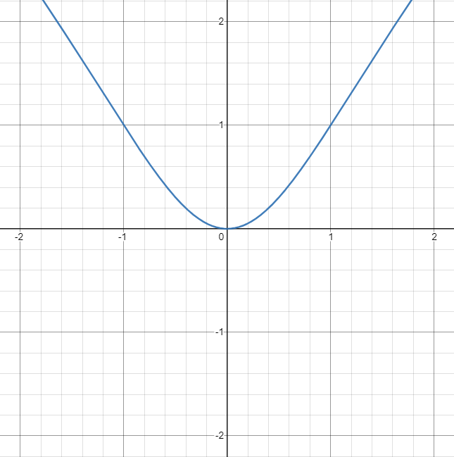

### Soft tanh

Actually called tanhsoft but I changed the name because I like soft tanh better. This one looks really weird.

`x * tanh(b * exp(l * x))`

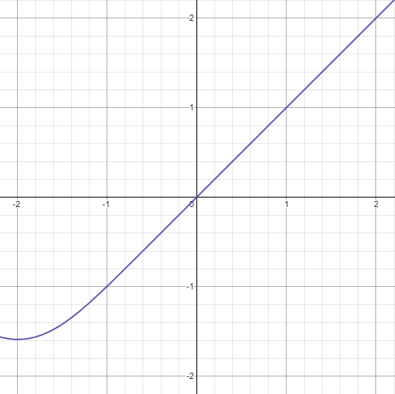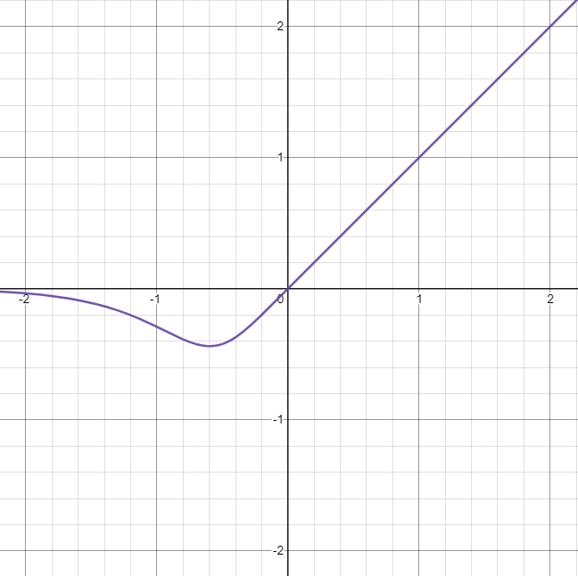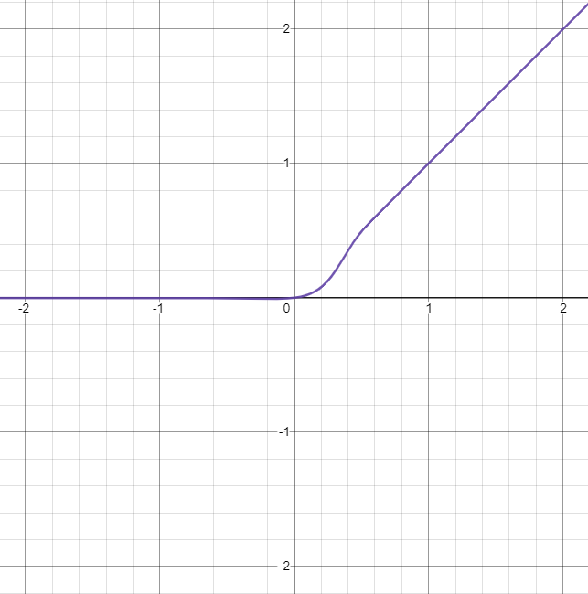

It's actually an entire family of activation functions, that is very new. I found it in [this paper](https://arxiv.org/pdf/2009.03863v1.pdf)

In my opinion this is the most unique sounding of them all.

Now that you made it to the bottom of the nerds section, I can reveal something cool: I intend to work with a family of distortion functions called ["Gated Recurrent Unit"](https://jatinchowdhury18.medium.com/complex-nonlinearities-episode-10-gated-recurrent-distortion-6d60948323cf). They can generalize a lot of different types of distortion, and complex forms of hysteresis (you know I love hysteresis). Maybe I can use them for physical modelling of analog distortion units? Who knows.

# Known Bugs
For a detailed list, see the issues tab.
- Loud pop at start-up (I know what causes it, but I don't care enough to fix this, I'm sorry)
